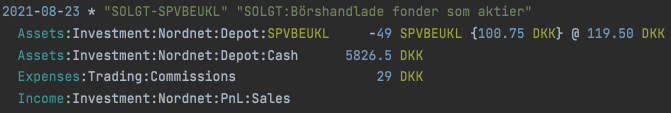

# Beancounter

My own implementation using the python library, [beancount](https://github.com/beancount).

# Current Results

## Knowing where my money goes

Beancount requires that transactions balance--that is, you categorize all parts of a transaction, and those
categories are custom, queryable, and sortable. Custom currencies mean you can hold stock with a relation to fiat
currencies, and still be aware of the details of the holding

## Human-readable storage format with rich & custom detail


<p align=center><i>Buying Stock</i></p>



<p align=center><i>Selling Stock</i></p>


<p align=center><i>Gaining dividends from stock</i></p>

## Custom Vue interface with API to query and render


More to come here.

## Standard "Fava" views

### Flexible overview of my own category spending:


### Overview of value of Stock Holdings, Unrealized profit, Cash Holdings.


### Overview of income and sources of it


## Support for several banks' formats

- Danske Bank
- Saxo Bank
- Nordnet
- Charles Schwab (WIP)
- Mekur (WIP)
- Visma Payslip

## Near full automation

Only manual steps are:

- Download relevant files from your bank
- Move them to the data folder
- The 3 below scripts could be run as one, but as you may want to:
  - Create a new account during mapping
  - verify the account balance, before moving the imported files.
- Run the mapping script
- Run the start script
- Run the move script. (or run the mock-move if you want to be sure files are moved properly)

This can be done as frequently as you want, but I wouldn't see a need to do it more than monthly

# Electron App:

Here you can see the visual progression of implementing an interface.


_With D3 now being supplied by an API making BQL queries_

<details>
<summary>Previous Statuses</summary>

January 11th 2022


_Now with React as well_
I think ill try to replace this with vue, much simpler fw.

Have to think and make a plan for it.

January 10th 2022


_First version of Electron running Express_

</details>

# General to do:

- Build a robust API to make BQL queries to support use cases.
  - This is in progress, but has a long way to go before I would call it robust.
- Build as much of GUI on top as electron app:
  - For importing/categorizing entities
  - Complete a nice way to visualize the bql queries
  - Find out how to handle selling at different cost basis.
    - This solution probably includes beanquery

# Usage:

- Clone the repo
- Set up a virtual python env(or not--but highly recommended). I did it on [pycharm](https://www.jetbrains.com/help/pycharm/creating-virtual-environment.html#python_create_virtual_env)
- [populate that venv](https://stackoverflow.com/questions/41427500/creating-a-virtualenv-with-preinstalled-packages-as-in-requirements-txt) with the requirements.txt file
- You will have to separately [install tkinter](https://askubuntu.com/questions/505141/unable-to-install-import-tkinter), as it is a c++ lib. I'm going to see if <it is viable to build a
  different and nicer interface later...but for now this is how to do.
- See if you can run any of the scripts. If you are using pycharm the `.run` directory contains run configurations for
  the below-mentioned scripts.
- Download you relevant bank files, and move them to the `data` dir

- Open the scripts folder
- Decide which operation you want to do:
  - `map.sh`: Test the purchase classifier on the bank account input file, build a mapping to be used later.
  - Does not create beancount file.
  - `start.sh`: Apply the built mapping to your beancount file, consume files
  - `check.sh`: Only check the file: if you hear nothing that is good :)
  - `fava.sh`: Visualize the provided beancount file with fava.
  - `move.sh`: Move your ingress files from `data`folder to structured folders after ingestion. -
  - `mock-move.sh`: Same as above, in mock mode "-n", check if you implemented the file_account function on the
    importer as expected.
  - `test.sh`: Test smaller parts of the code to avoid mapping or start processes.

Paths present in the scripts may need adjusting.

You will also have to chmod u+x the scripts.

## Write your own bank's importer!

Adding a new importer to a different bank is pretty trivial--you have several examples of how to handle different formats. Copy, paste,
test using run mapping script :)

Make sure to get the right encoding, accepted values can be found here:
https://docs.python.org/3/library/codecs.html#encodings-and-unicode

You can determine what encoding the downloaded bank file is in, by running this in the cli.

```
>> file filename
>> 2021-11-14.Nordnet-Depot-Transactions.csv: Little-endian UTF-16 Unicode text, with very long lines, with CRLF line terminators
```

# Importer Details

Each importer is written to match the source bank's format. Unfortunately, these files not always contain the neccessary
information to create the desired double ledger format. Let's talk about how we address that in the importers.

Danske Bank: No changes needed. After logging into netbank and selecting the relevant account, first select the period you want covered:


And then save as file:


Nordnet: No changes needed.
Go to transactions

Select the period, export


Saxo Bank: The relevant information is spread across multiple available files.
So I download each and consolidate them as sheets in an excel file.

Log into Saxotrader.com
Go to Account in the center top
In Historic Reports download the _Trades_ and _Account Statement_ files
In P/L Analysis download the _Closed Positions_ file
Merge the P/L sheet to the trades file, so that it is the 4th sheet (index 3)
Merge the Account sheet to the trades file, so that it is the 5th sheet (index 4)
Move the file and begin!

I use API calls to assist the investment account's with determining unrealized gains.

# Known issues:

- unrealized gains will not be able to find a price for the entity in the same "start" run as when it was purchased.
  To get the price, after running, execute move.sh, then re-run start.sh to resolve.
- marketstack api has 100 requests per month--I have to use 2 per stock to get the price. Probably enough, but while
  testing I used all pretty quick.
- round is inconsistent--I plan to work on cleaning that up

# If you want to edit this or build something similar:

Motivation:
https://beancount.github.io/docs/command_line_accounting_in_context.html#motivation

Getting Started:

https://beancount.github.io/docs/getting_started_with_beancount.html

Based on source code from here:
https://github.com/beancount/beancount/tree/v2/examples/ingest/office

Documentation here:
https://docs.google.com/document/d/11EwQdujzEo2cxqaF5PgxCEZXWfKKQCYSMfdJowp_1S8/edit#

Trading Details:
https://beancount.github.io/docs/trading_with_beancount.html
